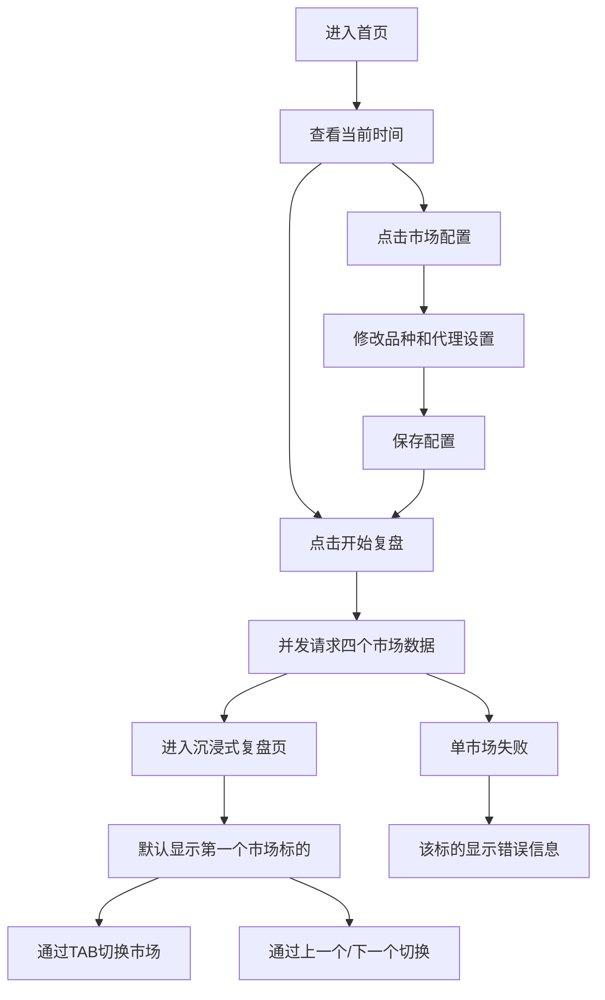

## 1. 产品概述
市场复盘工作台是一个面向个人交易者的轻量化 Web 应用，用于一键拉取并展示多市场的近期行情复盘数据。
- 解决用户在 A 股、美股、区块链、大宗期货之间切换数据源繁琐、查看维度不统一的问题。
- 产品目标是先完成单品种、多市场、可配置代理、可稳定拉取 240 根 K 线与成交量的首版复盘工具，并优先适配 iPad 使用场景。

## 2. 核心功能

### 2.1 功能模块
1. **首页**：当前时间、开始复盘按钮、市场配置按钮。
2. **市场配置弹层/面板**：四个市场的单品种配置、数据源信息、代理开关与代理端口设置。
3. **沉浸式复盘页**：一次只展示一个市场/标的的 240 根 K 线与成交量，支持市场 TAB 和上一个/下一个切换。

### 2.2 页面明细
| 页面名称 | 模块名称 | 功能描述 |
|-----------|-----------|-----------|
| 首页 | 当前时间区 | 大号时间与日期展示，作为极简启动页核心内容 |
| 首页 | 开始复盘按钮 | 点击后并发拉取四个市场的行情数据并进入沉浸式复盘页 |
| 首页 | 市场配置按钮 | 打开配置面板，编辑市场品种与网络代理设置 |
| 复盘页 | 市场 TAB | 展示四个市场标签，点击切换当前展示市场 |
| 复盘页 | 当前标的区 | 展示当前标的名称、代码、数据源与最近更新时间 |
| 复盘页 | K 线图表区 | 沉浸式展示 240 根 OHLC K 线与成交量柱状图 |
| 复盘页 | 上一个/下一个按钮 | 在当前配置的标的列表中前后切换 |
| 市场配置面板 | A 股配置 | 默认配置 1 个 A 股品种及其数据源参数 |
| 市场配置面板 | 美股配置 | 默认配置 1 个美股品种及其数据源参数 |
| 市场配置面板 | 区块链配置 | 默认配置 1 个币安交易对及其 interval 参数 |
| 市场配置面板 | 大宗期货配置 | 默认配置 1 个期货品种及其数据源参数 |
| 市场配置面板 | 网络代理配置 | 提供代理总开关、端口配置、是否对各数据源启用代理 |

## 3. 核心流程
用户打开首页后，只看到当前时间和两个核心操作。用户可直接点击开始复盘，也可先进入市场配置面板调整默认品种、代理开关和端口。点击开始复盘后，系统读取当前配置，并发请求四个市场的数据源，统一转换成前端图表所需的 K 线和成交量结构，并进入沉浸式复盘页。复盘页默认展示第一个市场，用户可通过顶部市场 TAB 或底部上一个/下一个按钮切换当前展示标的。单个市场请求失败时，仅当前标的展示错误信息，不影响其他已成功市场的浏览。

## 4. 用户界面设计
### 4.1 设计风格
- 主色：深石墨黑、冷灰蓝；强调色：荧光青、交易红、上涨绿。
- 按钮样式：大尺寸圆角按钮，带微弱霓虹描边与悬浮态发光。
- 字体建议：标题使用有数字终端感的展示字体，正文使用清晰的无衬线字体。
- 布局方式：iPad 优先的沉浸式单屏布局；首页极简居中，复盘页以单张大图表为核心。
- 图标建议：使用线性图标风格，突出行情、网络、配置与状态。

### 4.2 页面设计概览
| 页面名称 | 模块名称 | UI 元素 |
|-----------|-----------|-----------|
| 首页 | 时间区 | 超大号当前时间、日期、副标题 |
| 首页 | 操作按钮区 | 两个主按钮，触屏友好的大尺寸点击区域 |
| 复盘页 | 市场 TAB 区 | 四个大尺寸切换按钮，适合触屏操作 |
| 复盘页 | 当前标的信息 | 市场名、标的名、代码、来源、最近更新时间 |
| 复盘页 | K 线图表区 | 深色大尺寸图表、红绿 K 线、成交量柱、悬浮信息提示 |
| 复盘页 | 导航按钮区 | 上一个/下一个大按钮，支持横屏下双侧布局 |
| 市场配置面板 | 配置表单 | 市场分类卡、输入框、开关、端口设置、保存按钮 |

### 4.3 响应式
iPad 优先设计，重点适配横屏与竖屏触控场景；首页保持极简居中布局，复盘页确保单图表区域尽量占满可用空间，在较小屏幕下降级为单列堆叠布局。

## 5. 默认业务配置
- A 股：默认品种为 `sh000001`，用于展示上证指数日线复盘。
- 美股：默认品种为 `AAPL`，用于展示苹果公司日线复盘。
- 区块链：默认品种为 `BTCUSDT`，数据来自 Binance Kline 接口。
- 大宗期货：默认品种为 `AU0` 或等价黄金主连合约标识，首版以可稳定获取的公开接口为准。
- K 线数量：固定拉取最近 240 根。
- 展示维度：OHLC + Volume。
- 网络代理：默认关闭，支持通过端口 `13004` 快速开启；各市场共享同一代理设置。

## 6. 非功能要求
- 当某个市场数据源失败时，页面需保留其他市场成功结果。
- 首版不要求用户登录，不引入数据库持久化，配置保存在本地浏览器。
- 需要提供清晰的数据源标识，便于后续替换为更稳定渠道。
- 需要提供基础测试与真实请求验证，确认默认配置下四个市场都能正常获取数据。
