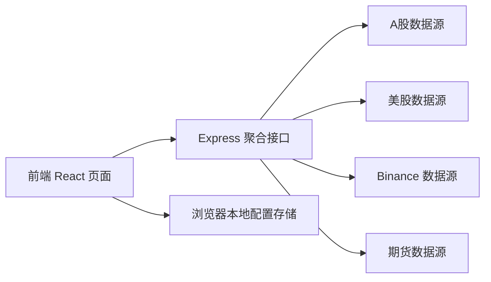
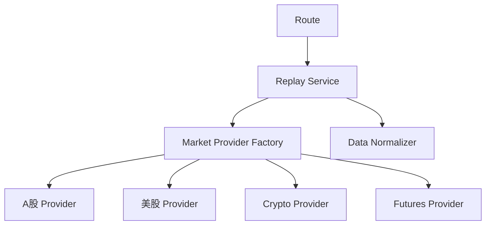
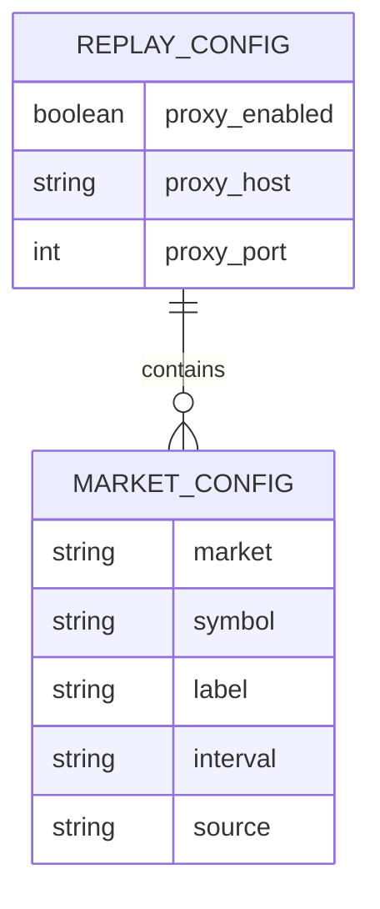

## 1. 架构设计
首版采用前后端一体的 TypeScript 工程。前端负责配置、交互和图表展示，后端负责代理网络请求、屏蔽跨域问题、统一转换多市场数据格式。外部数据源优先采用公开 HTTP API，避免引入数据库和额外云服务。



## 2. 技术说明
- 前端：React 18 + TypeScript + Vite + Tailwind CSS + Zustand
- 后端：Express + TypeScript + Node Fetch/Undici
- 图表：`lightweight-charts`
- 测试：Vitest 用于前端与数据转换逻辑，Node 脚本/接口调用用于真实数据验证
- 初始化工具：`vite-init`

## 3. 路由定义
| 路由 | 用途 |
|------|------|
| `/` | 单页应用，包含极简首页、市场配置抽屉与沉浸式复盘视图 |
| `/api/replay/fetch-all` | 拉取当前四个市场默认配置数据 |
| `/api/replay/fetch-market` | 单市场拉取数据，便于调试和测试 |
| `/api/config/defaults` | 返回默认市场配置与数据源说明 |

## 4. API 定义

### 4.1 前端共享类型
```ts
export type MarketType = 'a_share' | 'us_stock' | 'crypto' | 'futures'

export interface ProxyConfig {
  enabled: boolean
  host: string
  port: number
}

export interface MarketConfigItem {
  market: MarketType
  symbol: string
  label: string
  interval: string
  source: string
}

export interface CandleItem {
  time: number
  open: number
  high: number
  low: number
  close: number
  volume: number
}

export interface MarketReplayResult {
  market: MarketType
  symbol: string
  label: string
  source: string
  candles: CandleItem[]
  status: 'success' | 'error'
  errorMessage?: string
}
```

### 4.2 接口约定
#### `GET /api/config/defaults`
- 返回默认市场配置、代理默认值、数据源说明。

#### `POST /api/replay/fetch-all`
- 请求体：
```ts
{
  proxy: ProxyConfig
  markets: MarketConfigItem[]
}
```
- 响应体：
```ts
{
  results: MarketReplayResult[]
  fetchedAt: string
}
```

#### `POST /api/replay/fetch-market`
- 请求体：
```ts
{
  proxy: ProxyConfig
  market: MarketConfigItem
}
```
- 响应体：
```ts
MarketReplayResult
```

## 5. 服务端架构图


## 6. 数据模型
### 6.1 配置模型定义


### 6.2 本地存储定义
首版不使用数据库，配置持久化到浏览器 `localStorage`。前端额外维护当前是否进入复盘模式，以及当前激活市场索引，用于沉浸式单标的切换。

```ts
type LocalReplayConfig = {
  proxy: ProxyConfig
  markets: MarketConfigItem[]
}
```

```ts
type ReplayViewState = {
  started: boolean
  activeMarketIndex: number
}
```

## 7. 外部数据源策略
- A 股：优先使用腾讯/新浪类公开日线接口或兼容公开 HTTP 数据源；首版以无需密钥、可稳定抓取日线 240 根的渠道为准。
- 美股：优先使用 Stooq 或 Alpha Vantage 替代方案中的公开可访问接口；若需要 CSV/日线转换，则在服务端统一转换。
- 区块链：使用 Binance `klines` 接口，支持通过可配置代理访问。
- 大宗期货：优先使用东方财富/新浪期货公开行情接口或兼容公开数据服务，服务端做标准化转换。

## 8. 代理与配置策略
- 提供统一代理配置：`enabled`、`host`、`port`。
- 默认值：`enabled=false`、`host=127.0.0.1`、`port=13004`。
- 代理仅在服务端请求外部数据时生效，避免浏览器直接承担代理与跨域复杂度。
- 所有市场共用一套代理设置，便于快速切换。

## 9. 前端交互策略
- 首页仅展示当前时间、日期和两个大按钮，减少视觉负担。
- 点击开始复盘后，并发拉取四个市场数据，成功后进入沉浸式复盘视图。
- 复盘视图顶部提供市场 TAB，底部提供上一个/下一个按钮；两者都映射到当前市场索引。
- 当前页面一次只渲染一个市场图表，优先保障 iPad 上的阅读面积与触控效率。

## 10. 测试与验证策略
- 编写数据标准化单元测试，验证 K 线结构与 240 根截取逻辑。
- 编写接口层测试，验证默认配置返回结构。
- 使用真实网络请求脚本分别测试 A 股、美股、区块链、大宗期货默认品种是否能拿到有效数据。
- 本地开发阶段若 Binance 或其他市场被网络限制，可开启 `13004` 代理开关进行验证。
- 使用浏览器联调验证首页、配置抽屉、市场 TAB、上一个/下一个按钮在 iPad 风格布局下都可正常工作。

## 11. 仓库规范
- 初始化 Git 仓库并绑定远程 `git@github.com:valarxu/trade-daily.git`。
- 采用常见 GitHub 项目结构：`README.md`、`.gitignore`、MIT 或待定许可证、清晰脚本命令与环境配置说明。
- 敏感配置写入 `.env.example`，不提交真实私密信息。
